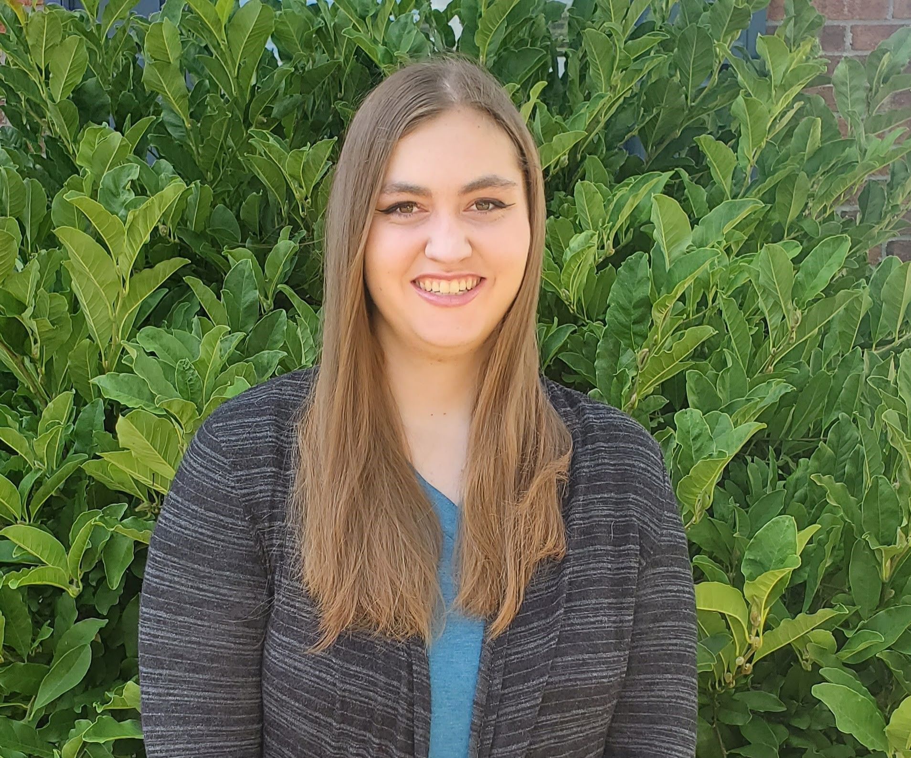

<h1> Julia Heffner </h1>
    
 I am an environmental scientist with a degree in Wildlife and Fisheries Management. I love anything related to nature. I am brand new to coding, and I am hoping to learn python to incorporate into my current field. This is a link to my favorite native plant website if you want to create your own native garden <a href="https://www.prairienursery.com/" target="_blank">Prairie Nursery</a>
    

<h3> Hobbies </h3>
    <ul>
        <li> Nature </li>
            <ul>
             <li> Hiking </li>
             <li> Kayaking </li>
             <li> Bird watching </li>
             <li> Gardening </li>
            </ul>
        <li> Other Activities </li>
            <ul>
             <li> Dog training </li>
             <li> Reading </li>
             <li> Learning new skills such as coding... </li>
            </ul>
    </ul>

